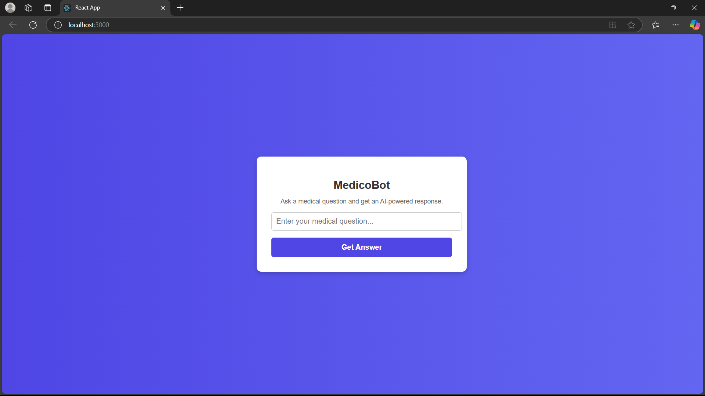
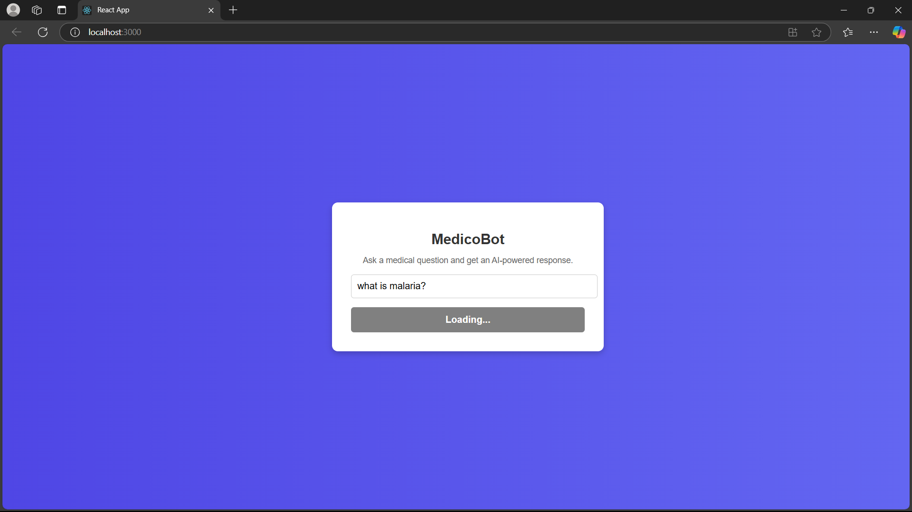

# Medico-Bot 2.0 

Medico-Bot 2.0 is an AI-powered medical assistant that leverages Generative AI to assist with querying medical information. Built with **LangChain**, **LlamaCpp**, **ChromaDB**, and **BioMistral-7B**, it answers user queries based on content extracted from medical PDFs.This project demonstrates the power of RAG and how combining document retrieval and language models can improve the accuracy and relevance of responses.


## Features
**Medical Querying:** Answer medical queries by providing accurate responses based on medical documents.
**PDF Integration:** Extracts text from multiple medical PDF documents and indexes them for fast retrieval.
**RAG (Retrieval-Augmented Generation):** Combines document retrieval with generative models to produce context-aware answers.

---

## Technology Stack
**Frontend:** React
**Backend:** 
- LangChain: Used for building the retrieval-augmented generation (RAG) pipeline.
- LlamaCpp: A C++ implementation of Llama models, used for text generation.
- ChromaDB: A vector database for storing and retrieving document embeddings.
- Sentence Transformers: Used to generate embeddings for text documents.
- Flask: Web framework used to deploy the model as an API.

---

## Screenshots 

<div>
   
   
   
</div>

---

## Prerequisites
   Before running the project locally, ensure you have the following installed:
     Python 3.10 / 3.11
     pip (Python package installer)

---

## Setup Instructions
1. Clone the repository
   ```bash
   git clone <your-repository-url>
   cd <your-project-folder>
   ```

2. Install **Backend** required dependencies
   You can install the required Python packages by running the following command:
    ```bash
    pip install -r requirements.txt
    python bot.py
    ```
    Alternatively, you can install the individual packages:
   ```bash
   pip install flask flask-cors langchain_community sentence-transformers chromadb llama-cpp-python PyPDF2
   python bot.py
   ```

3. Install frontend dependencies:
   ```bash
   npm install
   npm run build
   npm start
   ```


